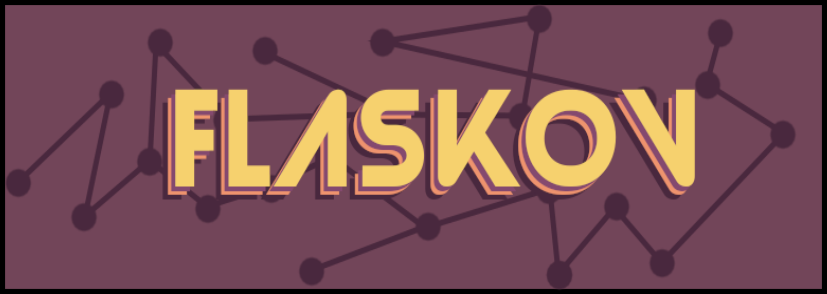

# Flaskov
      

Generating pseudo-sentences with Python, Flask, and Markov Chains.
Project is in it's infancy at current.

# About

Markov Chains are simple stochastic models that predict the future state of a system using only the current state. Despite being very naive models, you can effectively generate *fake sentences* by constucting them using a corpus of actual sentences. Consider the following sentences
1. I am very scared.
2. I hate spiders.
3. Spiders are very creepy.
A Markov Chain model constructed from this corpus might look a bit like:

where each node represents a word in a sentence, and the numbers are relative weights (or probabilites) for words that follow. You can increase the accuracy of these models by adding to the corpus, or increasing the amount of words used to predict the next word (e.g. ('I', 'am') ---> 'very'). Other tooling exists in the Python ecosystem that can be joined with this method to improve sentence generation further .

I started this project to learn more about web-development while playing around with this concept.
# Features

Coming Soon!

# Screenshots

Coming Soon!

# Installation

clone the directory, setup a python virtual environment, pip3 install -r requirements.txt, and runt the server. More detailed isntructions to come at a later date

# Contributing

Fork it, write some stuff, and submit a pull request!